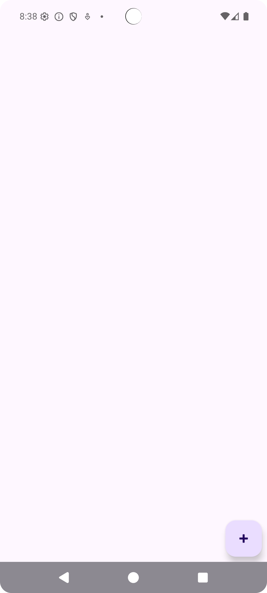
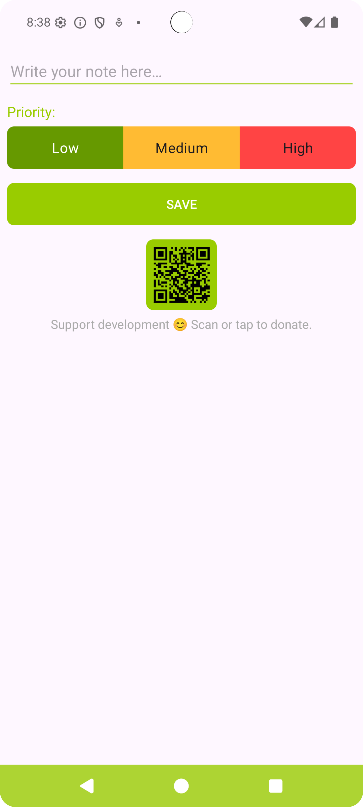
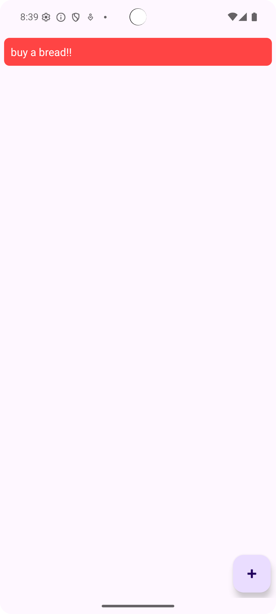
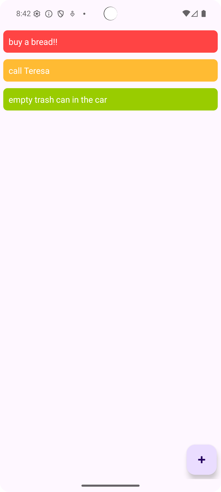
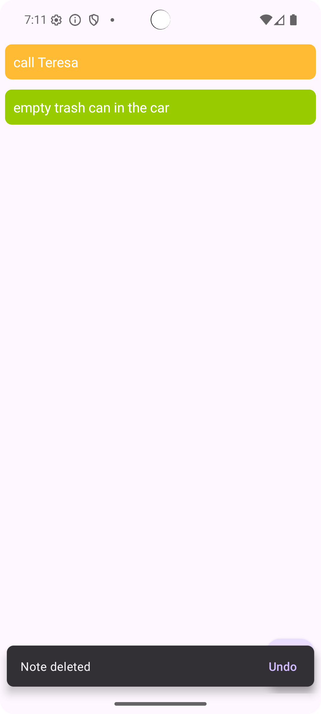

# Simplest Notes

A clean, minimalistic Android app for quickly taking and organizing notes — without ads, clutter, or complexity.

## ✨ Features

- 📝 Create, edit, and delete notes
- 🔴 Prioritize notes (Low, Medium, High)
- 💾 Offline-first — no network required to use
- 📤 Lightweight — fast and smooth
- ❤️ Donate via QR code (optional)

## 📸 Screenshots

  
  
  
   
  
  

## 📦 Download

📱 [Latest release APK](https://github.com/Trase1/SimplestNotes-app/releases/latest)

To install:
1. Download the `.apk` file
2. Open it on your phone
3. Enable **“Install from unknown sources”** if prompted

> Built for Android 7.0+ (API 24 and above)

## 📦 Available on

  

## 💡 Why this app?

Most note apps are bloated. **Simplest Notes** gives you exactly what you need — nothing more.

## 🙏 Support Development

If you find the app useful, consider scanning the QR code inside the app to donate 🙌

## 📄 License

Licensed under the [MIT Licence](LICENSE)
